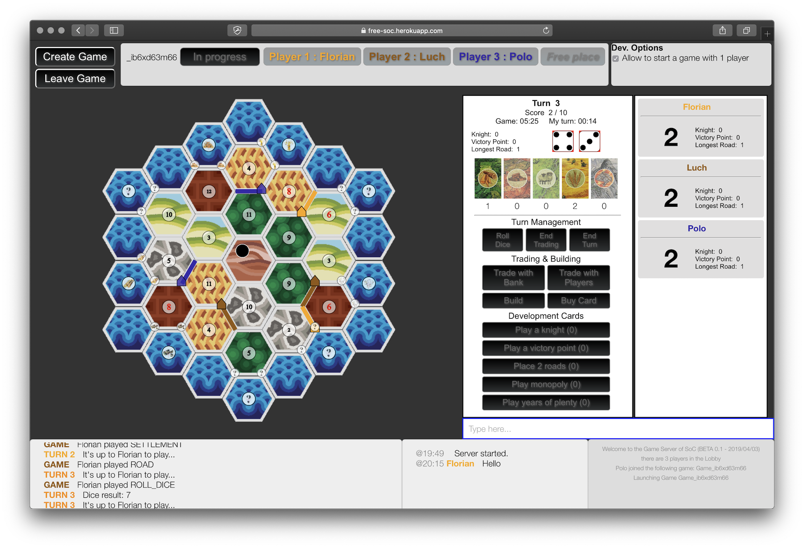

# Free-SoC
Match-making server using _node.js_ and _socket.io_



## Install and run

To install:

```
npm install

node index.js
```

To run locally, go to [http://localhost:3000](http://localhost:3000)

BETA version playable at [https://free-soc.herokuapp.com/](https://free-soc.herokuapp.com/)

## Versions

##### 1.0.0 (BETA) - 2019/04/05
* Playable
* Development option to “Auto roll dice“
* Players panel displays current action
* Not implemented: trading with the other players

##### BETA 0.1 - 2019/04/03
* Playable
* Development option to “Allow to start a game with 1 player“
* Not implemented: trading with the other players

## Description of sources

### Client side

* index.html
* style.css
* main.js - The main client script:
    * to connect to the server with socket.io
    * for login and chat management
    * to create, join or quit a game
    * to manage an ongoing game
* [jquery](https://code.jquery.com/jquery-1.10.2.min.js)
* [fabric.js](http://fabricjs.com/) - An node module to manage objects a the canvas

### Server side

* index.js - The server with [express](https://expressjs.com/) and socket.io
* soc.js - The game engine with the model and the main functions:
    * init (_players_, _options_)
    * canPlay (_player_, _action_, _data_)
    * play (_player_, _action_, _data_)

## Game Rules

The object of the game is to be the first player to get 10 Victory Points (VP).

### Starting

The classic game starts by having each player place two settlements and a road connected to each settlement.

#### Game Play

1. You must roll for resource production (the result applies to all players).
2. You may trade resources with other players or bank.
3. You may build roads, settlements or cities and/or buy _Development Cards_. You may also play one _Development Card_ at any time during your turn.
4. After you're done, end th turn to pass the dice to the next player, who then continues the game with step 1.

### Game Turn in Detail

__Important:__ notice that you may play one _Development Card_ at any time during your turn so before rolling the dices too. But you can play only one _Development Card_ during your turn.

#### 1. Resource Production
You begin your turn by rolling both dice.
The sum of the dice determines which terrain hexes produce resources.
Each player who has a settlement on an intersection that borders a terrain hex marked with the number rolled receives 1 _Resource Card_ of the hex's type.
If you have 2 or 3 settlements bordering that hex, you receive 1 _Resource Card_ for each settlement.
You receive 2 _Resource Cards_ for each city you own that borders that hex.
If there is not enough of a given resource in the supply to fulfill everyone's production, then no one receives any of that resource during that turn.

#### 2. Trade
Afterwards you may trade freely (using either or both types of trades below) to gain needed _Resource Cards_:

##### Trade with other players
On your turn, you can trade _Resource Cards_ with any of the other players. You can announce which resources you need and what you are willing to trade for them. The other players can also make their own proposals and counter offers.

__Important:__ Players may only trade with the player whose turn it is. The other players may not trade among themselves.

##### Trade with bank
You can also trade without the other players! During your turn, you can always trade at 4:1 by putting 4 identical _Resource Cards_ back in their stack and taking any 1 _Resource Card_ of your choice for it. If you have a settlement or city on a harbor, you can trade with the bank more favorably: at either a 3:1 ratio or in special harbors (trading the resource type shown) at 2:1.

__Important:__ The 4:1 trade is always possible, even if you do not have a settlement on a harbor.

#### 3. Build
Now you can build. Through building, you can increase your victory points, expand your road network, improve your resource production, and/or buy useful Development Cards.


To build, you must pay specific combinations of _Resource Cards_ (see the Building Costs Card). Take the appropriate number of roads, settlements, and/or cities from your supply and place them on the game board. Keep Development Cards hidden in your hand.

You cannot build more pieces than what is available in your pool a maximum of 5 settlements, 4 cities, and 15 roads.

##### Road
_Requires: Brick & Lumber_

A new road must always connect to one of your existing roads, settlements, or cities.
Only 1 road can be built on any given path.
The first player to build a continuous road (not counting forks) of at least 5 road segments, receives the Special Card "Longest Road".
If another player succeeds in building a longer road than the one created by the current owner of the "Longest Road" card, he immediately takes the Special Card (and its 2 victory points). In this case, there is a 4 victory point swing!

##### Settlement
_Requires: Brick, Lumber, Wool, & Grain_

Take special note of the "Distance Rule": you may only build a settlement at an intersection if all 3 of the adjacent intersections are vacant.
Each of your settlements must connect to at least 1 of your own roads.
Regardless of whose turn it is, when a terrain hex produces resources, you receive 1 Resource Card for each settlement you have adjacent to that terrain hex.
Each settlement is worth 1 victory point.

##### City
_Requires: 3 Ore & 2 Grain_

You may only establish a city by upgrading one of your settlements.
Cities produce twice as many resources as settlements.
You acquire 2 _Resource Cards_ for an adjacent terrain hex that produces resources.
Each city is worth 2 victory points.

##### Buying Development Card
_Requires: Ore, Wool, & Grain_

When you buy a _Development Card_, it is added to your deck but can only be played on the next turn.
There are 3 different kinds of these cards: _Knight_; _Progress_; and _Victory Point_. Each has a different effect.
_Development Cards_ never go back into the supply, and you cannot buy _Development Cards_ if the supply is empty.

#### Special Cases

##### Rolling a "7" and Activating the Robber
If you roll a "7", no one receives any resources.

Instead, every player who has more than 7 _Resource Cards_ must select half (rounded down) of his Resource Cards and return them to the bank.

Then you must move the robber. Proceed as follows:

1. You must move the robber immediately to the number token of any other terrain hex or to the desert hex.
2. Then you steal 1 (random) Resource Card from an opponent who has a settlement or city adjacent to the target terrain hex. The player who is robbed holds his Resource Card hand face down. You then take 1 at random. If the target hex is adjacent to 2 or more players' settlements or cities, you choose which one you want to rob.

__Important:__ if the production number for the hex containing the robber is rolled, the owners of adjacent settlements and cities do not receive resources. The robber prevents it).

##### Playing Development Cards

At any time during your turn, you may play 1 _Development Card_. That card, however, may not be a card you bought during the same turn!

###### Knight (aka "Soldier") Cards

If you play a Knight Card, you must immediately move the robber. See "Rolling a "7" and Activating the Robber" above and follow steps 1 and 2.
Once played, Knight Cards remain face up in front of you.
The first player to have 3 Knight Cards in front of himself receives the Special Card "Largest Army," which is worth 2 victory points.
If another player has more Knight Cards in front of him than the current holder of the Largest Army card, he immediately takes the Special Card and its 2 victory points.

###### Progress Cards

If you play a Progress Card, follow its instructions. Then the card is removed from the game (i.e., tossed in the box).

###### Victory Point Cards

You must keep Victory Point Cards hidden.
You may only reveal them during your turn and when you are sure that you have 10 victory points—that is, to win the game. Of course, you can reveal them after the end of the game when someone else wins.
You may play any number of Victory Point Cards during your turn, even during the turn you purchase them.

### End of the Game

If you have 10 or more victory points during your turn the game ends and you are the winner! If you reach 10 points when it is not your turn, the game continues until any player (including you) has 10 points on his turn.

___
_Florian Luchier - March 2019_